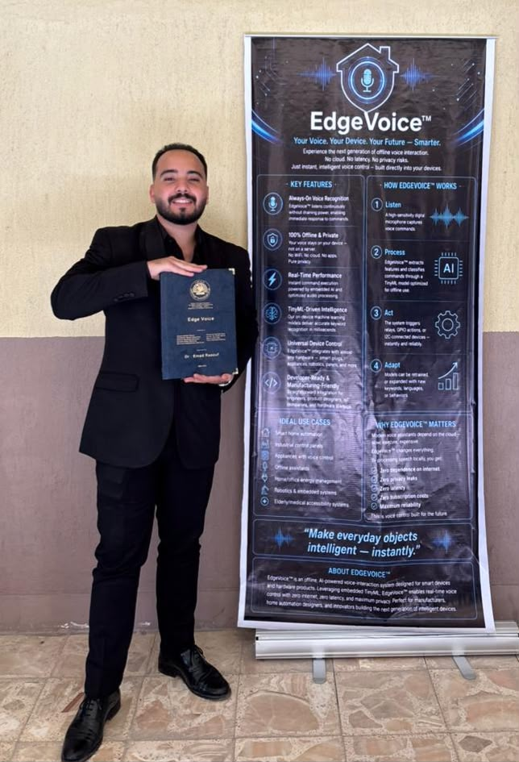

# 🚀 Mostafa Mohamed Elsayed — Flutter Portfolio

[](https://flutter.dev)
[](https://dart.dev)
[](https://opensource.org/licenses/MIT)

A modern, high-performance portfolio website built with the latest **Flutter Web (3.27+)** features. This project showcases a blend of creative UI/UX and engineering expertise in mobile-to-hardware integration (BLE/IoT).

 

---

## ✨ Key Features

- **Adaptive Responsive Engine**: Custom layout logic that adapts seamlessly from ultra-wide monitors to mobile screens.
- **Cinematic Animations**: Orchestrated entrance and scroll-aware animations using `flutter_animate`.
- **Interactive Particle System**: Custom-painted floating particles with code-inspired symbols.
- **Serverless Contact Form**: Direct email integration via **EmailJS** using modern `js_interop`.
- **Modern Color Engine**: Utilizes the latest Flutter `withValues()` API for precise, high-performance color manipulation.
- **PWA Ready**: Optimized with a custom `manifest.json` for installable web app support.

## 🛠️ Technical Implementation

### Core Stack
- **Framework**: Flutter Web (Stable Channel)
- **Architecture**: Modular Section-based UI for easy scalability.
- **Typography**: Optimized Inter & Google Fonts integration.

### Modern API Usage
> [!NOTE]
> This project follows the latest Flutter best practices (Post-3.22):
> - **Color Migration**: Fully migrated from `withOpacity` to `.withValues(alpha: ...)` to avoid precision loss.
> - **JS Interop**: Uses `dart:js_interop` (WASM compatible) instead of legacy `dart:js`.

## 📂 Project Architecture

```text
lib/
├── sections/        # Modular page segments (Hero, About, Projects, Contact)
├── theme/           # Unified design system (Colors, Typography, Gradients)
├── widgets/         # Atomic UI components (Buttons, Cards, NavBars)
└── main.dart        # Global configuration & Entry point
```

## 🚧 Roadmap

- [x] Initial Portfolio implementation
- [x] PWA Support & Manifest optimization
- [x] Modern API Migration (`withValues`, `js_interop`)
- [ ] **Admin Dashboard**: For dynamic project management and analytics.
- [ ] **Dark/Light Mode**: Dynamic theme switching.
- [ ] **Blog Section**: Integration with Markdown for technical articles.

## 🚀 Deployment

1.  **Clone**: `git clone https://github.com/MostafaMo426/my_portfolio.git`
2.  **Fetch Packages**: `flutter pub get`
3.  **Run**: `flutter run -d chrome`
4.  **Build**: `flutter build web --web-renderer canvaskit --release`

## 📧 Connect with Me

<p align="left">
<a href="https://www.linkedin.com/in/mostafa-mohamed-00435b332/" target="blank"></a>
<a href="https://wa.me/201204852902" target="blank"></a>
</p>

- **Email**: [safymo81@gmail.com](mailto:safymo81@gmail.com)
- **GitHub**: [@MostafaMo426](https://github.com/MostafaMo426)

---
Developed with ❤️ by **Mostafa Mohamed Elsayed**
